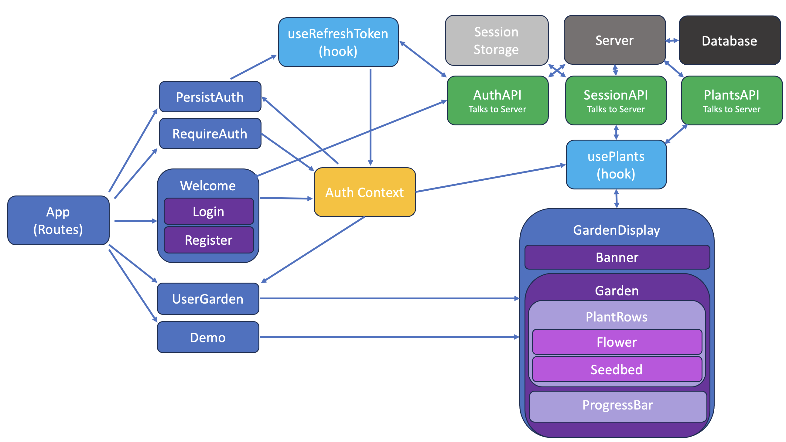
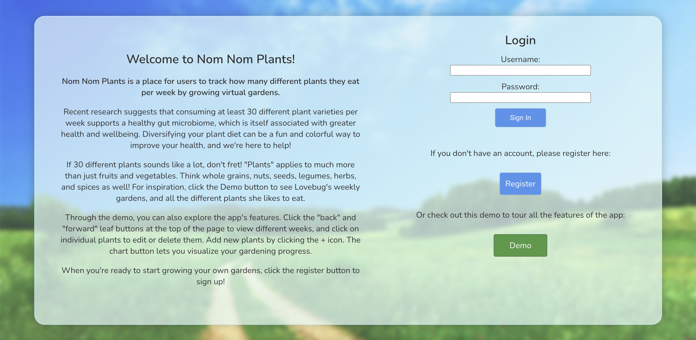
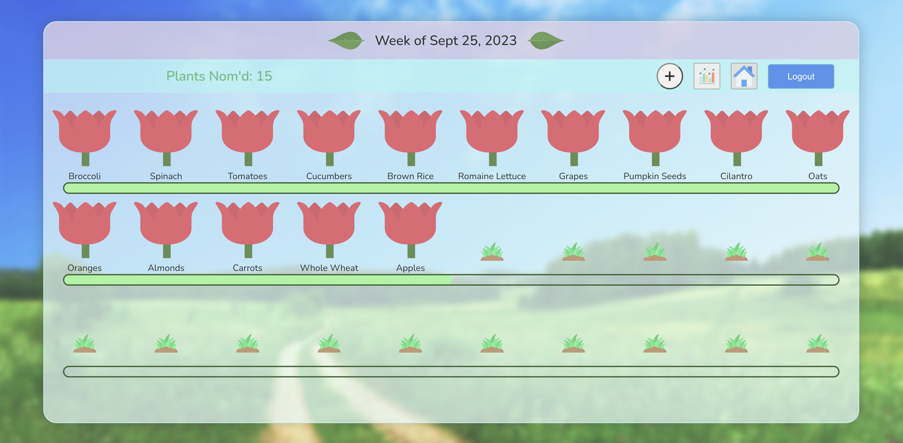
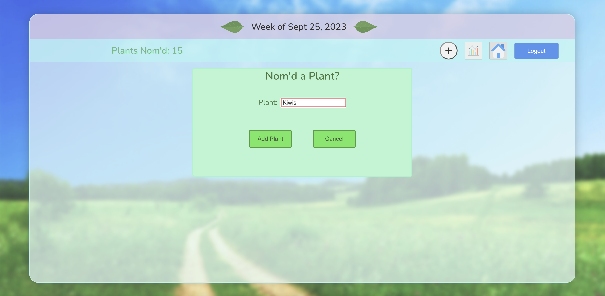
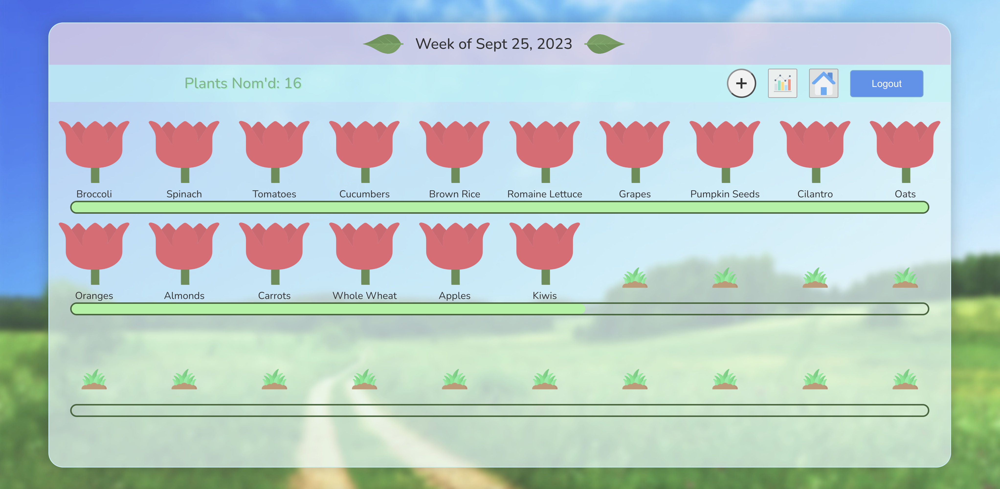
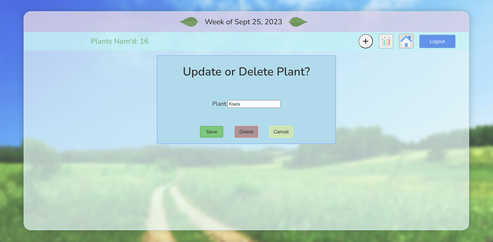

# Nom Nom Plants
Author: Monika Davies\
Version: 1.0.0

## Overview
Nom Nom Plants offers a fun and playful way for users to improve their health. Users grow virtual gardens representing how many different plants they eat each week and track their progress.

## Repositories

Frontend: https://github.com/MonikaChris/nom-plants

Backend: https://github.com/MonikaChris/nom-plants-api

## Technologies Used

Frontend: React, React Router Dom\
Backend: Node.js, Express, MongoDB, Mongoose, JWT, Cookie-parser

## Features

Login vs. Demo Mode

- Supports two separate API’s, depending on whether a user is logged in, or the app is in demo mode.
- Demo mode uses dummy data and session storage, Login mode uses MongoDB.

Authentication

- Backend creates JWT access and refresh tokens, uses httpOnly cookies, and implements custom middleware to verify JWTs.
- Frontend uses React BrowserRouter with a RequireAuth component and Auth context to protect routes, and a PersistLogin component to refresh tokens after a page reload.

CRUD

- Users can view, create, update, and delete plants in their weekly personal or demo gardens.

## React Component Architecture

GardenDisplay receives a plants array from usePlants, which gets passed down in props. Garden calculates the number of PlantRow components needed, and each PlantRow calculates the number of Flower and Seedbed components needed.

Not pictured are modal components for adding, updating, deleting, and displaying errors.

## Pictures of Live Site

## Photo Credits

1. Landscape Background Photo:
Photo by <a href="https://unsplash.com/@arjabedbd?utm_source=unsplash&utm_medium=referral&utm_content=creditCopyText">Anisur Rahman</a> on <a href="https://unsplash.com/photos/K2b7UDed6uQ?utm_source=unsplash&utm_medium=referral&utm_content=creditCopyText">Unsplash</a>

2. Chart Icon (Nom History Button):
Graph icons created by Vectors Market - Flaticon\
https://www.flaticon.com/free-icons/graph
  